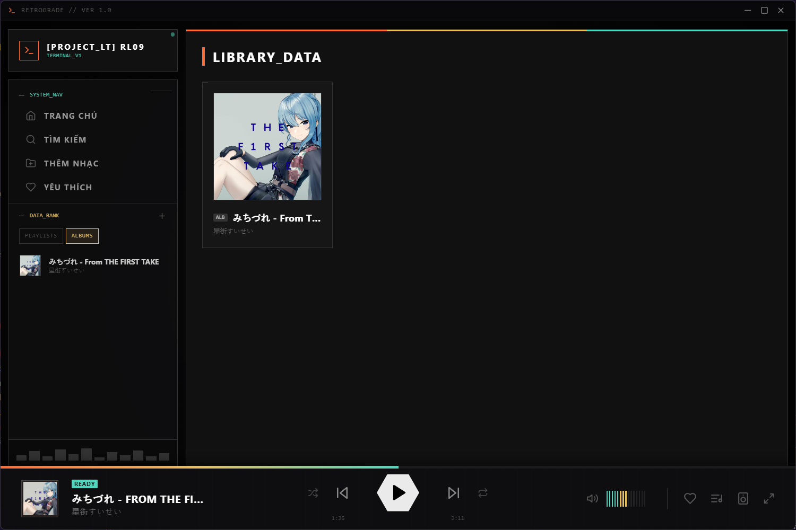
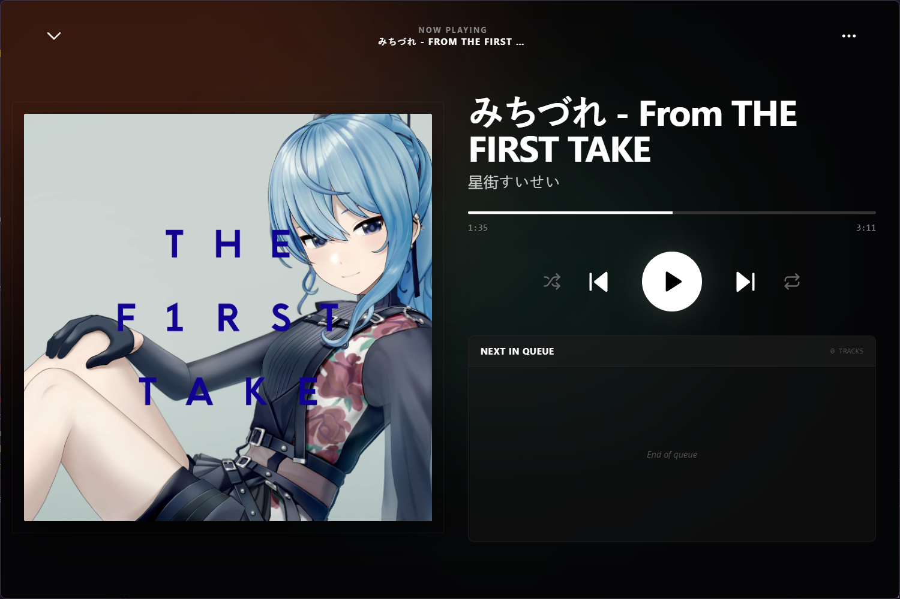

# Retrograde // Music Player
<div align="center">


<p align="center">
  <b>A high-fidelity, local music player built for music lovers with bit-perfect audio, blazing fast library indexing, and a retrofuturistic aesthetic.</b>
</p>

<p align="center">
  <a href="https://github.com/Misaka545/retrograde/releases"><b>⬇️ Download Latest Windows Installer (.exe)</b></a>
</p>

</div>

---

## Interface Preview

| **Library Grid View** | **Full Screen Player** |
|:---:|:---:|
|  |  |

---

## System Features

### Dual-Engine Audio Protocol
* **Bit-Perfect WASAPI Exclusive Mode:** Powered by a native background `mpv` process communicating over an IPC named pipe (`\\.\pipe\retrograde-mpv-socket`). Completely bypasses the Windows Audio Engine mixer for uncompressed, bit-perfect, zero-resample playback.
* **HTML5 Web Audio Fallback:** Lightweight built-in HTML5 audio engine for everyday casual listening.
* **Unified State & Seek Pipeline (`seekTrack`):** Seamless seeking and scrub synchronization across both WASAPI exclusive mode and standard HTML5 audio, including MediaSession API hooks, timeline sliders, and full-screen controls.
* **Hardware Audio Device Routing:** Inspect and switch between physical WASAPI audio output endpoints directly from the player interface.
* **Real-time Codec & Stream Inspector:** Automatic parsing and display of stream quality parameters (Codec, Bit Depth up to 32-bit, Sample Rates up to 192kHz+, Channel Count). Supports `FLAC`, `WAV`, `ALAC`, `MP3`, `AAC`, `OGG`, `OPUS`, and `WMA`.

### High-Velocity Scanner & Storage Engine
* **Multi-Threaded Worker Indexing:** Scanner utilizes Node.js `worker_threads` to parse directories and extract ID3/Vorbis tags concurrently without blocking the UI main thread.
* **Custom Binary FLAC Parser:** Fast stream parser (`flac-parser.js`) reads FLAC `STREAMINFO` and `VORBIS_COMMENT` metadata blocks directly from file headers in milliseconds without loading gigabytes of raw PCM audio into RAM.
* **Deterministic Track Identity:** Track IDs are deterministically anchored to absolute file paths, guaranteeing persistent playlists and liked songs across multiple rescans and restarts.
* **Two-Tier Thumbnail Cache:** Auto-generates lightweight 300×300 JPEG thumbnails for smooth grid browsing while caching full-resolution covers for the full-screen player view.
* **Persistent IndexedDB Storage:** Library catalog, playlists, and user metadata are stored locally in IndexedDB (`retrograde_db`), enabling sub-second cold starts with zero memory bloat.

### Performance-Engineered UI
* **Virtualized Search Engine:** Uses `useDeferredValue` coupled with `react-virtuoso` windowed grid rendering for search queries, effortlessly handling libraries with tens of thousands of tracks.
* **Smart Viewport Preloading:** Custom container-scoped `IntersectionObserver` with a 1,200px viewport buffer preloads local thumbnails ahead of user scroll velocity, completely eliminating blank image dropouts during rapid navigation.
* **Retrofuturistic Aesthetics:** High-contrast terminal color scheme with vibrant **Teal** (`#4FD6BE`), **Gold** (`#E8C060`), and **Orange** (`#FF6B35`) accents over deep void black (`#09090b`).
* **Celestial Orrery Startup Loader:** Custom-animated three-body orbital loader during initial database hydration.
* **Batch Operations:** Multi-select mode for batch deleting albums or adding multiple tracks to playlists at once.
* **System Tray & Background Mode:** Minimize to system tray with persistent playback and customizable exit prompts.
* **Secret Interactive Morse Terminal:** Interactive Morse code easter egg integrated into the sidebar controls (`LONETRAIL`).

---

## Tech Stack

* **Shell & Runtime:** [Electron](https://www.electronjs.org/) (v25+) & [Node.js](https://nodejs.org/) (v18+)
* **Audio Engine Backend:** Native [mpv](https://mpv.io/) via IPC JSON protocol
* **Frontend Framework:** [React 18](https://react.dev/) + [Vite](https://vitejs.dev/)
* **Virtualization:** [React Virtuoso](https://virtuoso.dev/)
* **Metadata Extraction:** Custom binary parsers + [music-metadata-browser](https://github.com/Borewit/music-metadata-browser)
* **Styling:** [Tailwind CSS](https://tailwindcss.com/) + Vanilla CSS
* **Icons:** [Lucide React](https://lucide.dev/)

---

## Project Architecture

```
retrograde/
├── bin/                          # Native binaries (mpv.exe for WASAPI mode)
├── electron/
│   ├── main.js                   # Electron main process & IPC handlers
│   ├── mpv-controller.js         # mpv process manager & IPC named pipe socket
│   ├── scanner.js                # Library scanner controller & thumbnail generation
│   ├── scanner-worker.js         # Multi-threaded worker thread metadata extractor
│   └── flac-parser.js            # Custom native binary FLAC header parser
├── src/
│   ├── assets/                   # Static branding, images, and screenshots
│   ├── components/
│   │   ├── AlbumDetail.jsx       # Detailed album tracklist & codec inspector
│   │   ├── CoverImage.jsx        # High-performance preloaded cover art component
│   │   ├── CustomModal.jsx       # Retro-styled confirmation modals
│   │   ├── FullScreenPlayer.jsx  # Immersive full-screen playback & queue overlay
│   │   ├── LibraryGrid.jsx       # Library catalog & virtualized search grid
│   │   ├── PlayerBar.jsx         # Bottom playback bar with granular volume & seek
│   │   ├── QueuePopup.jsx        # Playback queue popup drawer
│   │   ├── Sidebar.jsx           # Navigation, filters, and Morse code easter egg
│   │   ├── TerminalToast.jsx     # Tech diagnostic toast notifications
│   │   └── TitleBar.jsx          # Custom frameless window titlebar controls
│   ├── context/
│   │   └── PlayerContext.jsx     # Central audio playback state & session persistence
│   ├── utils/
│   │   ├── db.js                 # IndexedDB storage and cover art cache management
│   │   └── timeUtils.js          # Audio duration formatting utilities
│   ├── App.jsx                   # Root application container & view router
│   ├── index.css                 # Global cybernetic styles, scrollbars & keyframes
│   └── main.jsx                  # React application entry point
├── package.json
└── vite.config.js
```

---

## Installation & Setup

### Pre-built Windows Release (.exe)
For users who want to run Retrograde directly without setting up Node.js or development dependencies:
1. Head over to the [GitHub Releases](https://github.com/Misaka545/retrograde/releases) page.
2. Download the latest installer: **`Retrograde Setup 1.1.3.exe`** (or portable build).
3. Run the installer. All native binaries (including `mpv.exe` for bit-perfect WASAPI audio) are bundled automatically into the installation.

---

### Build from Source (Developer Setup)

#### Prerequisites
* **Node.js** (v18 or higher)
* **npm** or **yarn**
* **Windows 10/11** (Required for WASAPI Exclusive Mode)
* **MPV Binary:** Download a Windows build of `mpv.exe` (from [mpv.io](https://mpv.io/) or [shinchiro's builds](https://sourceforge.net/projects/mpv-player-windows/files/)) and place it inside the `bin/` folder.

#### Instructions

1. **Clone the Repository**
   ```bash
   git clone https://github.com/Misaka545/retrograde.git
   cd retrograde
   ```

2. **Install Dependencies**
   ```bash
   npm install
   ```

3. **Install MPV for WASAPI Mode**
   * Create a `bin` directory at the project root if it does not already exist:
     ```bash
     mkdir bin
     ```
   * Download `mpv.exe` for Windows and place it inside:
     ```
     retrograde/bin/mpv.exe
     ```

4. **Launch Development Environment**
   ```bash
   npm run electron:dev
   ```

5. **Package Executable Installer (.exe)**
   ```bash
   npm run electron:build
   ```
   *Electron-builder will bundle the production distribution and copy the native `bin/mpv.exe` into an NSIS installer (`Retrograde Setup <version>.exe`) and unpackable binaries inside the `release/` directory.*

---

## Controls & Shortcuts

| Action | Control / Shortcut |
|---|---|
| **Play / Pause** | `Spacebar` / On-screen Hexagonal Button |
| **Previous / Next Track** | `MediaKeys` / On-screen Skip Buttons |
| **Prev Track Rewind** | Clicking `Prev` when `currentTime > 3s` restarts current track |
| **Granular Volume Adjust** | Scroll wheel over volume area (`1/15` step intervals) |
| **Seek Track** | Drag or click progress bar (compatible with WASAPI & HTML5) |
| **Context Menu** | Right-click any album or track to like, delete, or add to playlist |
| **Toggle Fullscreen** | Click maximize icon on player bar |
| **Dismiss Overlays** | `Escape` key |
| **Morse Code Easter Egg** | Click colored sidebar bars to input Morse code (`.-.. --- -. . - .-. .- .. .-..`) |

---

## License

This project is licensed under the [MIT License](LICENSE.md).

Copyright (c) 2025 Misaka